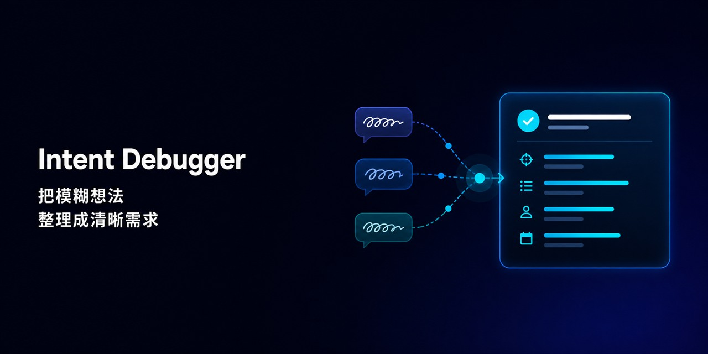

<p align="center">
  
</p>

<h1 align="center">Intent Debugger</h1>

<p align="center">
  <strong>需求澄清与意图对齐</strong><br>
  把说不清的想法，整理成清楚、具体、可核对的需求。
</p>

<p align="center">
  <a href="skill/intent-debugger/SKILL.md"></a>
  <a href="adapters/claude-code/README.md"></a>
  <a href="adapters/deepseek/README.md"></a>
  <a href="LICENSE"></a>
  <a href="https://github.com/bydtesla1609/intent-debugger/stargazers"></a>
</p>

<p align="center">
  <a href="#-快速开始">⚡ 快速开始</a>
  &nbsp;·&nbsp;
  <a href="#-使用示例">💬 使用示例</a>
  &nbsp;·&nbsp;
  <a href="#-它和-plan-模式有什么不同">🧭 与 Plan 的区别</a>
  &nbsp;·&nbsp;
  <a href="#-参与贡献">🤝 参与贡献</a>
</p>

## ✏ 写在最前面

当用户让 AI 设计一个项目或功能时，AI 可能会堆砌技术手段。对不熟悉专业术语的用户来说，这些内容看起来很专业，却很难用来判断 AI 是否真正理解了需求。若是能够**从最终效果、使用方式和功能边界**出发，就更易于形成一份双方都能看懂、也能逐项核对的需求理解。

从上述背景出发，我们关键的问题在于很难一次把想法说清楚：脑中已经有了大概的样子，却不知道对应的专业术语；已经尽量描述，AI 还是理解成了另一件事；双方还没核对清楚，AI 就开始设计或写代码，最后发现方向从一开始就偏了。

Intent Debugger 不要求你先学会写专业提示词。你只需要尽量说出想要的效果、使用方式、担心的问题和能想到的例子，等等。哪怕表达得绕、很别扭，它也会把这些信息整理成一份**结构化、规范化的需求清单**，让你判断 AI 理解的，究竟是不是你想做的。

## 🧩 它会做什么

每轮工作都会围绕三部分展开：

1. **🧭 需求梳理**：先用一两句话说明当前理解，再展开目标、场景、功能、流程和约束。
2. **❓ 问题澄清与确认**：针对每个关键问题，先说明问题是什么、为什么需要注意，再提出具体、可以直接回答、会影响需求的选择。
3. **✅ 当前共识**：说明哪些内容已经确认、哪些仍是暂定理解，以及是否已经对齐。

在用户确认需求已经对齐之前，会持续迭代这份需求清单：保留已经确认的信息，根据用户的回答进一步优化。

## 🚧 工作边界

| Intent Debugger 会做 | Intent Debugger 不会做 |
| --- | --- |
| 保留用户原本的目标 | 擅自增加用户没有提出的功能 |
| 让描述更清楚、具体、专业 | 用术语掩盖仍未理解的地方 |
| 指出真正影响需求的问题 | 为了凑格式制造无关问题 |
| 等待用户确认关键理解 | 自动进入设计、技术方案或代码实现 |

当用户确认需求无误、关键问题已经回答且不存在重大歧义时，Intent Debugger 的任务就结束了。它不会自动转入任何规划、设计或实现工作。

## 🧐 它和 Plan 模式有什么不同

Intent Debugger 回答“到底要做什么”，Plan 回答“在具体项目里准备怎么做”。

| | Intent Debugger | Plan 模式 |
| --- | --- | --- |
| 要回答的问题 | 到底要做什么，为什么做，边界在哪里？ | 已经确认的需求该怎么落地？ |
| 适合的输入 | 口语化想法、愿景、零散功能、互相冲突的描述 | 范围和验收标准已经清楚的任务 |
| 主要产出 | 整理后的需求、尚未解决的问题、需要用户确认的选择 | 结合现有项目形成的实施步骤、改动范围和验证办法 |
| 是否进入技术层面 | 不进入 | 可以进入 |

## ⚡ 快速开始

### Codex

将 [`skill/intent-debugger`](skill/intent-debugger) 复制到 Codex 的个人 Skill 目录：

```text
$CODEX_HOME/skills/intent-debugger
```

重新加载 Skill 后，可以显式调用：

```text
使用 $intent-debugger 帮我梳理这个想法：我想做一个帮助团队找资料的工具。
```

在明显属于模糊需求澄清的场景中，Codex 也可以根据 Skill 描述自动选择它。

### Claude Code

Claude Code 支持读取 `SKILL.md`。将 [`skill/intent-debugger`](skill/intent-debugger) 复制到以下任一位置：

- 个人级：`~/.claude/skills/intent-debugger/`
- 项目级：`.claude/skills/intent-debugger/`

然后输入 `/intent-debugger` 显式调用，也可以由 Claude Code 根据 `description` 选择。具体说明见 [Claude Code 适配指南](adapters/claude-code/README.md)。

### DeepSeek

DeepSeek API 没有相同的文件式 Skill 发现机制。使用 DeepSeek API 或支持 system prompt 的客户端时，将 [`SKILL.md`](skill/intent-debugger/SKILL.md) 的完整内容作为首条 `system` 消息，再把具体想法作为 `user` 消息发送。具体说明见 [DeepSeek 适配指南](adapters/deepseek/README.md)。

> 三个平台共用同一份核心 Skill。适配指南说明的是加载方式，不代表已经对所有客户端版本做过相同的实时效果测试。

## 📝 使用示例

用户原话：

> 我想在网页里加一个首页 / 控制面板 / 键盘这样一级一级跳过去的东西，还要能看见现在在哪一层。

Intent Debugger 会先建立原描述和专业术语之间的对应关系：

> 在网页中加入**面包屑导航（Breadcrumb Navigation）**，展示用户当前所在的层级路径，并允许用户返回上级页面。

但它不会停在术语替换上，还会继续确认：哪些层级可以点击、当前页面是否可点击、路径过长时怎样显示、用户通过其他入口进入页面时路径如何生成。确认后的结果会写回同一份需求草稿。

[查看“团队知识库搜索工具”的完整使用示例 →](examples/team-knowledge-base.md)

## 🤝 参与贡献

没有仓库写入权限也可以贡献。你可以先让 Intent Debugger 把使用反馈整理成规范的改进候选，核对后通过公开 Issue 提交；已经准备好具体修改的用户，也可以 Fork 仓库并发起 Pull Request。

- [提交改进候选](https://github.com/bydtesla1609/intent-debugger/issues/new?template=improvement-candidate.yml)
- [查看贡献说明](CONTRIBUTING.md)
- [浏览 Issues](https://github.com/bydtesla1609/intent-debugger/issues)

所有候选都由维护者公开审核，不会因为内容由 AI 整理就自动写入或合并。

## 📖 行为验收

仓库使用 [`evals/cases.md`](evals/cases.md) 中的场景检查 Skill 的实际行为，而不是只检查它有没有输出固定标题。

<details>
<summary><strong>查看主要验收标准</strong></summary>

- 是否在不改变用户目标的前提下，形成有依据、可核对的需求理解；
- 是否把合理推断标为暂定理解，而不是用户已经确认的事实；
- 是否发现真实的歧义、冲突、边界情况或风险；
- 是否针对每个关键问题说明其影响，并提出可直接回答、会影响决策的确认问题；
- 是否在未对齐前避免技术方案和代码；
- 多轮确认时，是否保留已确认信息、及时修正错误并停止重复追问；
- 表达是否自然，有没有机械套模板、重复解释或滥用术语。

</details>

## 📄 License

本项目采用 [MIT License](LICENSE) 开源。

<p align="center">
  <strong>先把“要做什么”说清楚，再判断 AI 是否真的理解了你。</strong><br>
  如果这个项目对你有帮助，欢迎点一个 Star ⭐
</p>
